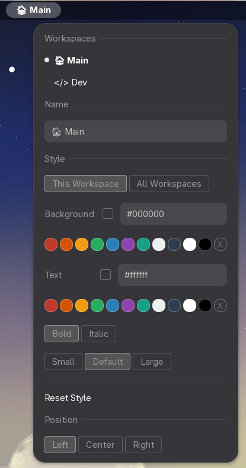
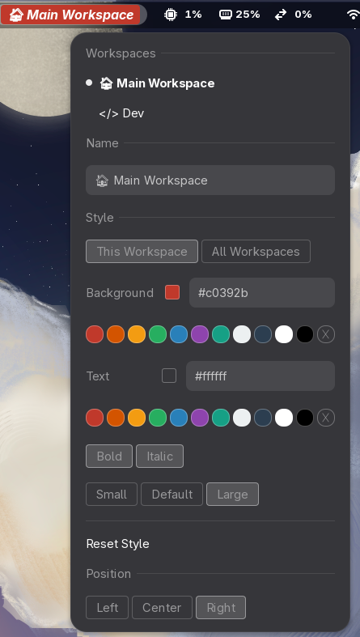

# Named Workspaces

A GNOME Shell extension that displays the current workspace name in the top panel with inline editing and per-workspace styling.

## Features

- Shows the current workspace name in the panel
- Double-click to rename a workspace inline
- Single-click to open a menu with:
  - Workspace name editing
  - Background and text color customization
  - Bold toggle
  - Per-workspace or global style scoping
  - Style reset

## Supported GNOME Versions

45, 46, 47, 48, 49

## Installation

via Extensions Manager, or from source.

### From source

```sh
# Clone and link to GNOME Shell extensions directory
git clone https://github.com/a31labs/gnome-named-workspaces.git
ln -s "$(pwd)/gnome-named-workspaces" ~/.local/share/gnome-shell/extensions/named-workspaces@a31.at

# Compile the schema
glib-compile-schemas schemas/

# Restart GNOME Shell (X11: Alt+F2 → r → Enter, Wayland: log out and back in)
# Then enable the extension
gnome-extensions enable named-workspaces@a31.at
```

## Screenshots





## Publish

```bash
glib-compile-schemas schemas/
gnome-extensions pack --force --extra-source=stylesheet.css --extra-source=LICENSE
mv named-workspaces@a31.at.shell-extension.zip named-workspaces@a31.at.zip
```
